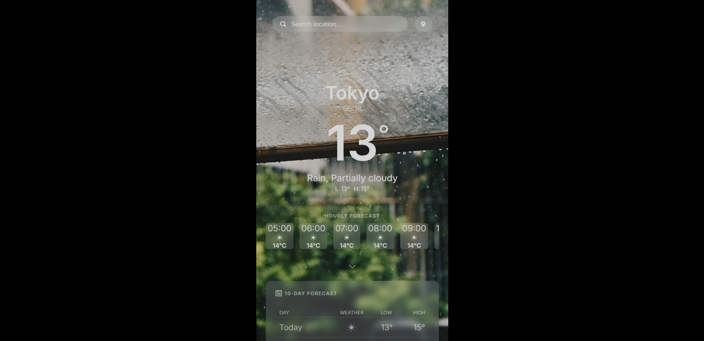

# Weather App

The Odin Project - JavaScript Course Project 4:

A Weather Forecast website built using HTML, CSS, and JavaScript. The app fetches weather data from the Visual Crossing Weather API to provide real-time weather information.

The app provides detailed weather forecasts for a specific location, offering both current weather data, hourly forecast, and 10-day forecast. It also offers geolocation input and toggling temperature between celsius and farenheit.

Note: It is bad practice to expose the API key. However, for this assignment from The Odin Project, it was acceptable as the provided API key is publicly available.

## Preview

Laptop view:

Mobile view:

## Links

Live Link: https://luciavu.github.io/weather-app/

Assignment: https://www.theodinproject.com/lessons/node-path-javascript-weather-app

## Credits

Icon from Fontello: https://fontello.com/

In order of appearance in images folder, images from Unspash by:

- Dhanya Purohit: https://unsplash.com/@dhanya22
- CHUTTERSNAP: https://unsplash.com/@chuttersnap
- Joshua Loh: https://unsplash.com/@joshualohyj1
- Madison Oren: https://unsplash.com/@artbyhybrid
- Benjamin Child: https://unsplash.com/@bchild311
- Bader Abdullah: https://unsplash.com/@3obdb
- Paul Pastourmatzis: https://unsplash.com/@pueblovista
- Suhyeon Choi: https://unsplash.com/@by_syeoni
- Mihika: https://unsplash.com/@lotusflowur
- Ali Arif Soydaş: https://unsplash.com/@aliarifsoydas
